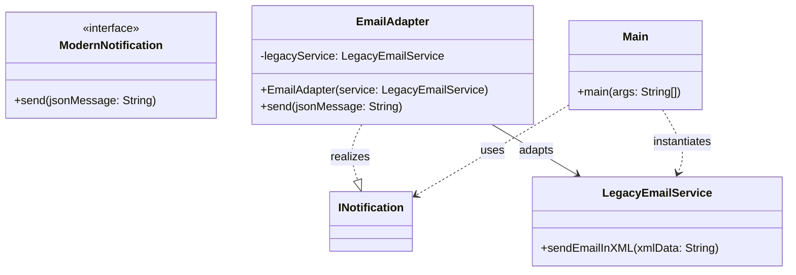

# 🔌 Adapter Pattern

You can think of the Adapter pattern as a real adapter. For example, someone came from the USA and wants to charge his laptop — he can't do it directly because the electricity plugs are just too different to begin with. So what do we use? We use an adapter.

In coding, it's usually used when we deal with legacy systems that use XML while we use JSON, or when an API provides data in miles and feet rather than meters that our code uses. Rather than changing the code, you just create a class called the **Adapter class**, that will find a way to translate between the two systems or APIs.

---

## How to Use the Adapter (Generally)

You must have at least two classes:
- **The Target** — yours, the new shiny one.
- **The Adaptee** — the old incompatible one.

Like in this example:

```java
// Our app expects JSON notifications
public interface ModernNotification {
    void send(String jsonMessage);
}
```

And we have an adaptee:

```java
public class LegacyEmailService {
    public void sendEmailInXML(String xmlData) {
        System.out.println("Legacy Service sending XML: " + xmlData);
    }
}
```

Obviously, those two can't work together — so we make an **Adapter**. This adapter implements (pretends, in very precise words) that it is a modern notification, and it will have an instance of the legacy class to find logic to make them work together:

```java
public class EmailAdapter implements ModernNotification {
    private LegacyEmailService legacyService;

    public EmailAdapter(LegacyEmailService service) {
        this.legacyService = service;
    }

    @Override
    public void send(String jsonMessage) {
        // 1. Convert JSON to XML
        String xmlMessage = "<msg>" + jsonMessage + "</msg>";

        // 2. Delegate the work to the legacy service
        legacyService.sendEmailInXML(xmlMessage);
    }
}
```

In the `main`, it will look something like this:

```java
public class Main {
    public static void main(String[] args) {
        // The old service we can't change
        LegacyEmailService oldService = new LegacyEmailService();

        // The adapter that makes it compatible —
        // it's pretending to be the original ModernNotification class
        INotification mailer = new EmailAdapter(oldService);

        // Our app code stays clean and modern
        mailer.send("{ 'body': 'Hello World' }");
    }
}
```

---

## Class Diagram

