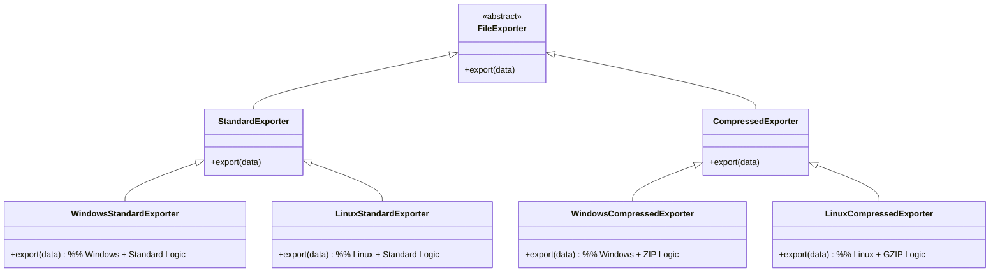
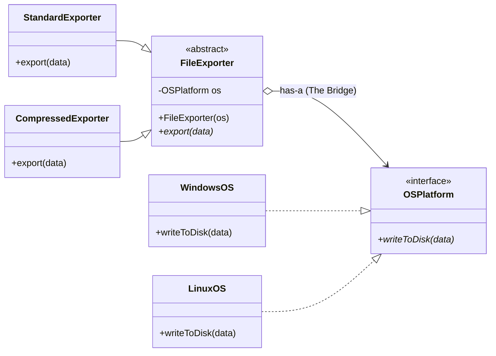

# 🌉 The Bridge Pattern

Imagine this — you have in your mind "I need a file exporter". Then you realize there are compressed files and standard files, and then you remember there are Windows or Linux. So if you think to make it with simple inheritance... bravo, 2×2 you got four classes at the end of the tree and 7 classes in **total**. Tomorrow you'll wake up and remember that macOS exists, so it will become 9 classes. Good job.



---

## The Solution

Aside from the trash talking, the Bridge pattern was made to solve this infinitely growing tree issue, by replacing inheritance with **composition**:



Instead of thinking that a person must inherit their skills (being the "son of a mechanic"), we think of it as having a **teacher**. You don't need to be born into a mechanic's family to gain mechanical skills — you just need to have a relationship with a mechanic who can perform those tasks for you.

> The one who is learning is often referred to as the **"Abstraction"**, because it mainly uses the skills or methods of the **"Implementation"** inside a bigger context or within another method.

---

## Code

Here are the low-level features — the **Implementation** side:

```java
// The "Implementation" interface
interface OSPlatform {
    void uploadToDisk(String data);
}

// Concrete Implementation for Windows
class WindowsOS implements OSPlatform {
    public void uploadToDisk(String data) {
        System.out.println("Windows API: Writing '" + data + "' to C:\\Exports\\");
    }
}

// Concrete Implementation for Linux
class LinuxOS implements OSPlatform {
    public void uploadToDisk(String data) {
        System.out.println("Linux Kernel: Writing '" + data + "' to /home/user/exports/");
    }
}
```

And here we see the **Abstraction** using them within the logic to build features:

```java
// The "Abstraction"
abstract class FileExporter {
    // This is the "Wired Arrow" (The Bridge)
    protected OSPlatform os;

    protected FileExporter(OSPlatform os) {
        this.os = os;
    }

    public abstract void export(String content);
}

// Refined Abstraction 1
class StandardExporter extends FileExporter {
    public StandardExporter(OSPlatform os) { super(os); }

    public void export(String content) {
        os.uploadToDisk(content); // No changes to data
    }
}

// Refined Abstraction 2 (The logic is here!)
class CompressedExporter extends FileExporter {
    public CompressedExporter(OSPlatform os) { super(os); }

    public void export(String content) {
        String compressed = "[ZIP]" + content + "[/ZIP]"; // Compression logic
        os.uploadToDisk(compressed);
    }
}
```

---

## Why "Bridge"?

It's called Bridge because of the **aggregation link** between the Abstraction and the Implementation — that connection *is* the bridge.

Thanks for reading! Next up: **Composite**. 


---

##  Further Reading

- [Bridge Pattern — Refactoring Guru](https://refactoring.guru/design-patterns/bridge)

>  **New to UML?** Read this first → [UML Class Diagrams for Beginners](https://blog.algomaster.io/p/uml-class-diagram-explained-with-examples)